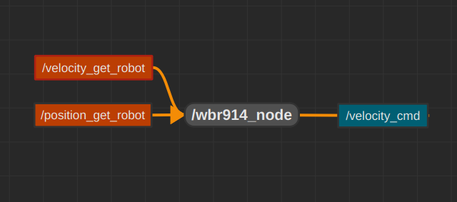

# 914-PC-BOT integration with raspberry pi 4 and ROS2


This project includes drivers,ROS2 nodes and instructions for using the WhiteBox914 in combination with raspberry pi 4 and ROS2.

Using this project will enable listening to wbr914 commands via the pi4 on it's startup,running ros nodes to communicate with the wbr914 and write new packages for it.

This README gives an overview on starting using the project.  
Other README in the project:

- [docs/raspberry_pi_setup.md](docs/raspberry_pi_setup.md): Setup the raspberry pi 4 for listening to commands and transmit them to the robot on startup.
- [src/README.md](src/README.md): Instructions for downloading ROS2,building packages and running them.
- [docs/developer_guide.md](docs/developer_guide.md): Guide for developers to create new ros2 nodes for communicating with the robot, and updating the robot driver itself.

The project is divided into 2 different layers which can be seen in the folder structure:

- **wbr914_base_driver** : First layer. The new robot driver and old player driver. For developers who aim to implement new functions that talk with the hardware
- **src** : Second layer. ROS2 packages
  - **wbr914_package** : API connecting wbr914 functions to ros2 nodes. <br> See [developer_guide](docs/developer_guide.md) for creating new API functions
  - **node_examples** : Examples for calling the nodes.
- **utils** : Files and scripts for setting up the project for the first time + quality of life files.
- **docs**

## Table of Contents

- [914-PC-BOT integration with raspberry pi 4 and ROS2](#914-pc-bot-integration-with-raspberry-pi-4-and-ros2)
  - [Table of Contents](#table-of-contents)
  - [Setup the project](#setup-the-project)
    - [Setup the pi4](#setup-the-pi4)
    - [Setup the workspace](#setup-the-workspace)
      - [Add the project path as an ENV variable](#add-the-project-path-as-an-env-variable)
      - [Downloading ROS2 and build packages](#downloading-ros2-and-build-packages)
  - [Communication with the robot](#communication-with-the-robot)
    - [Topic `velocity_cmd`](#topic-velocity_cmd)
    - [Service `velocity_get_robot`](#service-velocity_get_robot)
    - [Service `position_get_robot`](#service-position_get_robot)
  - [Running a ROS2 node](#running-a-ros2-node)
  - [Additional Resources](#additional-resources)
    - [Technical information about the robot](#technical-information-about-the-robot)
    - [Original robot drivers](#original-robot-drivers)
    - [WhiteBox-PC-BOT dropbox](#whitebox-pc-bot-dropbox)
    - [Player](#player)
  - [Contributing](#contributing)

## Setup the project

Setup of the project is divided into two parts:

1) Setup the pi4 itself on the robot.
2) Setup the workspace.

The setup work on the pi4 is intended to be a one time thing.
Once all setup is done,the pi4 will wait for commands the moment it gets power.

### Setup the pi4

Follow the instructions under [docs/raspberry_pi_setup.md](docs/raspberry_pi_setup.md)

### Setup the workspace

This is the computer where you will program + run ROS nodes to send robot commands.

#### Add the project path as an ENV variable

Add the following line to your .bashrc file:

```bash
export WBR914_PROJECT_PATH="/path/to/your/project"
```

#### Downloading ROS2 and build packages

All ROS packages of the project are under `src` folder.  
Read the [src/README.md](src/README.md) for instructions.

## Communication with the robot

On startup of the pi4, a ros2 node opens. that node is in charge of communicaton with the robot.  
The node opens multi channels for communication:

1) Topic called `velocity_cmd` on which velocity commands are sent to move the robot.
2) Service called `velocity_get_robot` to get the current robot velocity.
3) Service called `position_get_robot` to get the current robot position.



For implementation, see [the node file](src/wbr914_package/include/wbr914_package/wbr914_node.h)

### Topic `velocity_cmd`

The robot node listens for velocity commands on this topic.
Every time a command is caught by the node - one call for movement command is sent to the robot.  
**Notice that wbr914 expects to get commands continually, sending command only once will not move it.**

There are currently two node files in the project you can use to send velocity commands to the topic:

1) [velocity_publisher_continuous_basic](src/wbr914_package/include/wbr914_package/velocity_publisher_continuous_basic.h) - For sending commands infinitely, changing the velocity on user command whenever user wants. Recommended for first time.
2) [velocity_publisher_basic](src/wbr914_package/include/wbr914_package/velocity_publisher_basic.h) - Requests user command every 10 seconds, sending the command to the robot for this duration.

See the `Running a ROS2 node` section for instructions for running the nodes.

You can also use the terminal:

```shell
ros2 topic pub /velocity_cmd geometry_msgs/msg/Twist "linear:
  x: 0.05
  y: 0.0
  z: 0.0
angular:
  x: 0.05
  y: 0.0
  z: 0.0"
```

Notice the use of the Twist message type, only the x components are used.
The units are m/sec for linear velocity and rads/sec for angular velocity.

### Service `velocity_get_robot`

The service is used for getting the current velocity of the wbr914.  
It returns a Twist message and a bool value for success/failure of the request.
Failure means that communication with the robot failed.

In addition of calling the service from your code,you can test it using the terminal:

```shell
ros2 service call /velocity_get_robot wbr914_package/srv/VelocityGet
```

The node of wbr914 will respond with its current velocity.

### Service `position_get_robot`

The service is used for getting the current position of the wbr914.

In addition of calling the service from your code,you can test it using the terminal:

```shell
ros2 service call /position_get_robot wbr914_package/srv/PositionGet 
```

It returns a Pose message and a bool value for success/failure of the request.
A pose message is of the struct:

```shell
  position:
    x: X
    y: Y
    z: 0.0
  orientation:
    x: X
    y: 0.0
    z: 0.0
    w: 1.0
```

The X and Y in position represent the point at which the robot stands on, in relation to its starting position.  
**Units are in meters.**  

The X in orienatation orientation represent the robot axis around its middle.  
 **Units are in radians**

## Running a ROS2 node

Everytime a new terminal is opened, the built packages environment variables need to be sourced.

```shell
source ${WBR914_PROJECT_PATH}/src/install/setup.bash
```

This line can also be added to your .bashrc file for convenience.

After building packages,Running ROS executables is done by running the command:

```shell
ros2 run <package_name> <executable_name>
```

For example,to run wbr914 publisher in the `wbr914_package` package run:

```shell
ros2 run wbr914_package wbr914_velocity_publisher_continuous_basic
```

This command wil run a publisher that sends continuous velocity commands to the velocity topic by user request.

Assuming you already setup the pi4 - the pi4 will wait for commands on the velocity topic. Once you send a command,the robot will move.

## Additional Resources

### Technical information about the robot

Information about the robot sensors,power sources and more can be found under:

[docs/tech_specifications/](docs/tech_specifications/)

### Original robot drivers

The previous drivers written by the company can be found under the [/wbr914_base_driver/player_driver](/wbr914_base_driver/player_driver) folder.  
In the previous iteration of the robot,player platform was used.

Notice this driver uses player structs and functions. It won't work with ROS.

### WhiteBox-PC-BOT dropbox

Dropbox with manuals from the original company.
https://www.dropbox.com/home/WhiteBox-PC-Bot

### Player

wbr914 Isn't supposed to use player anymore, but if for some reason you want to to test it with player,you can download it from [player github](https://github.com/playerproject/player).

And a manual with explanation of using player with the robot is found under [docs/robot_using_player/WBR_914_PC-BOT_old_Linux-Version.pdf](docs/robot_using_player/WBR_914_PC-BOT_old_Linux-Version.pdf)

## Contributing

Contributions in the form of additional examples and documentation are welcome.  
If you are a student at the course and is interested in contributing to the project, Please talk with the instructors of the course for the consideration of extra credit.

**See github issues for ideas**
