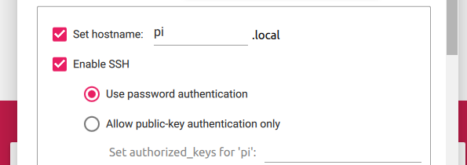
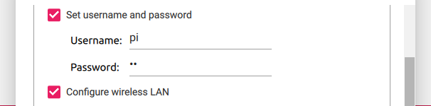
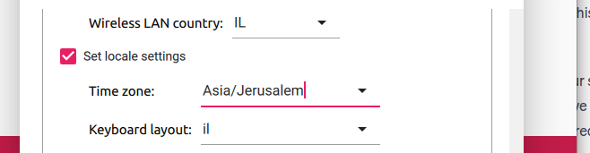
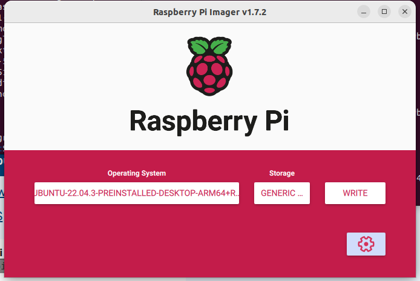

# Rasperry pi 4 setup

We will now set the rasperry pi 4 to run a node that listens for twist commands(velocity information) and send them to the robot. this node will get commands from the nodes we wrote to send those twist commands.

**another computer besides the pi4 is needed for the setup.**

## Setup Operating system

### Downloading an operating system on the pi4

Connect Your pi4 sd card to a USB stick and connect it to your computer.

using the rasperry pi4 imager:

```shell
sudo apt install rpi-imager
```

You have 2 ways to set up the pi 4 for running the node:

1) Using a server by downloading **Ubuntu Server 22.04.03 LTS**
2) Using a UI(desktop) by downloading **Ubuntu Desktop 22.04.03 LTS**

#### Ubuntu Server

Download Ubuntu Server to sim card with the help of the following guide:

https://ubuntu.com/tutorials/how-to-install-ubuntu-on-your-raspberry-pi#1-overview


Setup all of the advanced options(network,ssh,keyboard layout):





Note about network connection - assuming ssh is used,this default network and direct cable network will be the only way you can connect to the pi4 using ssh which means your only way to use it. If more networks are needed to be added,See `Setup automatic network connection with ssh` section in this file for details.

To connect using ssh,use the following format:

```shell
ssh <user_name>@<host_name>
```

user_name and host_name(ending with .local) were both setup in the advances options in the download.
Notice,in most guides the ip port is used for conencting instand of host_name,but was found to not actually work work(Connection refused is returned by pi4)

#### Ubuntu Desktop

download **Ubuntu Desktop 22.04.03 LTS** r ** on the rasperry pi 4:



**Note** Not Raspberry Pi OS, ROS2 is less supported on it.**

### Connect needed cables

Connect to the pi4 all neeeded cables - power(if using desktop - screen,keyboard and mouse)

### Setup internet

Power the pi 4 on. Connect in the pi4 to the internet you will use. On this internet all commands will be communicated between nodes. your pi4 and computer you send command from must be connected on the same internet.

## Setup workspace

### Clone the project to the pi4

we will use a listener(subscriber) ROS node to get velocity commands from other nodes. It is in the project itself.

 Clone the project using

```shell
git clone git@github.com:EyalBrilling/WhiteBox-PC-BOT-rpi4.git
```

### Add project path to .bashrc

our Cmake uses an ENV variable of the project path. Add it to your .bashrc using the following command:

echo 'export WBR914_PROJECT_PATH="<Path_to_project>"' >> ~/.bashrc && source ~/.bashrc

## Setup ROS2

The following 2 steps can be done for you by running 'rasperry_pi_setup.sh' in utils:

1) Give script premissions:

```shell
chmod +x rasperry_pi_setup.sh
```

2) Run it:

```shell
./rasperry_pi_setup.sh
```

### Download ROS2 on the pi4

Download ROS2 iron from:

https://docs.ros.org/en/iron/Installation/Ubuntu-Install-Debians.html

Follow the instructions. As we are using Ubuntu,Downloading ROS2 using Debian packages is done normally without the need for a docker.

### Setup USB premissions

Add your user to the dialout group:

```shell
sudo usermod -aG dialout <your_username>
```

## Get the velocity listener node executable

Now we need to get the executable that runs the listener node.
To do so, `e need to build it.

### Source setup.bash

Needs to be done every terminal

```shell
source /opt/ros/iron/setup.bash
```

### Build the velocity subscriber

In the src folder of the project, run:

```shell
colcon build
```

The executable is under `src/build/wbr914_velocity_package/wbr914_velocity_listener`

## Testing subscriber works

Lets checkout if the procces until now went succefully. we will try to run the node:

First source the built workspace:

```shell
source install/setup.bash
```

Then try to run the code:

```shell
ros2 run wbr914_velocity_package wbr914_velocity_listener
```

## Setup the velocity subscriber node to run on pi4 startup.

As the pi4 will be put on the robot,we want it to run the node and listen for commands on turning on. 

You have a shell file under 'utils' called "setting_node_on_startup.sh" to run the commands. The shell script assumes linux user name 'pi' is used. Look at it for explanation on what it does.

1) Give it premissions:

```shell
chmod +x setting_node_on_startup.sh 
```

2) Run it:

```shell
sudo ./setting_node_on_startup.sh
```

The shell file is based on the following guide:

https://mshields.name/blog/2022-03-16-running-ros-nodes-on-boot/

**Notice changes from guide:**

- This is a ros1 guide. ROS2 doesnt use roscore as there is not master node in it anymore. So the roscore.service isn't needed.

**Test with:**

sudo systemctl start roscore.service
sudo systemctl status roscore.service

If you get errors in service,journalctl is helpful:

```shell
sudo journalctl -u ros_package.service
```

## Note on safety

All logic of when to stop and run are in the responsibolty of other nodes. Make sure your code is safe so that your robot wont run away and jump out the window. The robot expects commands all the time,So once a node exits,assuming publishing of velocity commands stopped - robot will also stop. So just make sure there are no uncontrollable nodes running.

## Setup automatic network connection with ssh

It might be the case we can't connect to the pi 4 using a cable and you want to change the default network you connect to in a place without other networks. As ssh conenction require a network, we can set the wifi to be connected to before hand.

1) In the utils folder,you have a file `automatic_network_connection.yaml`.

```yaml
network:
  version: 2
  renderer: networkd
  wifis:
    wlan0:
      dhcp4: true
      access-points:
        "Your_SSID_Name":
          password: "Your_Password"
```

Replace the following(what inside " " includig " ") with your specific network details:
Your_SSID_Name: The SSID (name) of the Wi-Fi network.
Your_Password: The Wi-Fi network password.

2) Move the file from `utils` to `/etc/netplan/`. From utils run:

```shell
sudo cp ./automatic_network_connection /etc/netplan/
```

## Errors handling

### colcon build CMakeError

```shell
  By not providing "Findament_cmake.cmake" in CMAKE_MODULE_PATH this project
  has asked CMake to find a package configuration file provided by
  "ament_cmake", but CMake did not find one.
  .
  .
  .
```
  
  First,make sure you sourced ROS2 enviorment variables using:
  
```shell
source /opt/ros/iron/setup.bash
```
  
  If that still doesn't work - there is probably a problem with premission priviliages to the build folders because `sudo colcon build` was ran. solve it by:
  
1) Remove build folders in the src folder using

 ```shell
 sudo rm -rd src/install
 ```

Do the same for build and log folders.

2) build again `colcon build` without sudo
